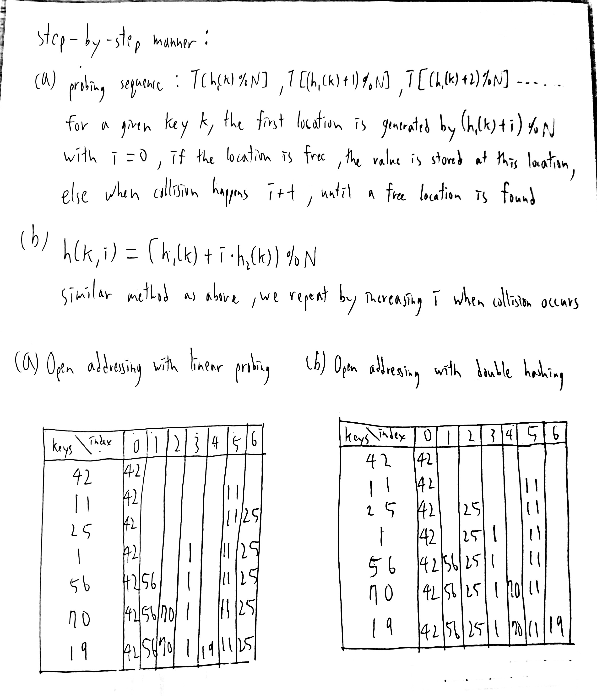
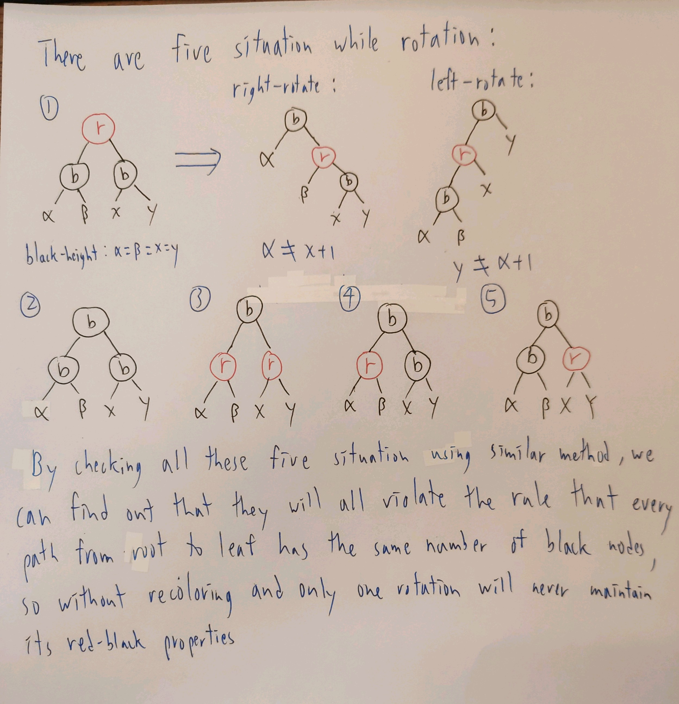
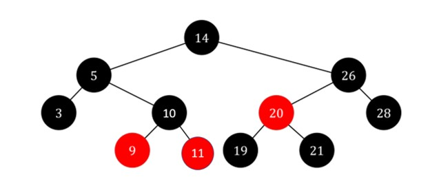
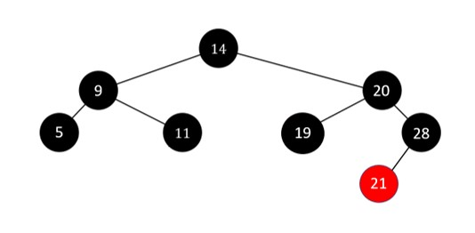
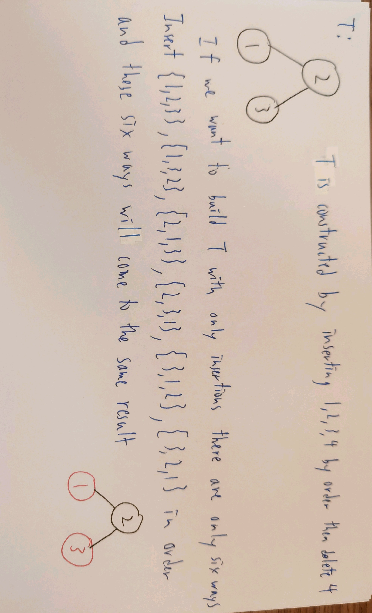

## B10902033 林祐辰 DSA HW-4  
### Problem 0:
1. 
2. 
3. 
4. 
### Problem 1:  
1. Process:
     
2. The function is changing the light pattern into binary digits by having 1 for light on and 0 for light off, example: {1, 3, 5, 7, 17} = 10000000001010101 = 2^16 + 2^6 + 2^4 + 2^2 + 2^0, and by doing so we are sure that every pattern will have a unique number. And the number are from 0 ~ 2^17-1 so the size of the array needed is 2^17 = 131072 < 133333.
3. Algorithm:
   ```C
    int find_max_consecutive_rooms(N ,energy_arr[], E):
        sum = 0, maxlen = 0
        create hash_table ht
        for i = 0 to N-1:
            sum += energy_arr[i]
            if sum == E:
                maxlen = i+1
            if sum is not in ht:
                Insert(sum, i)
            if (sum - E) is in ht:
                index = Get(sum - E)
                if maxlen < i - index:
                    maxlen = i - index
        return maxlen
   ```
   The time complexity is obviously O(N), and the space complexity is also O(N), since the space that hash_table need <= 2N.
4. The expected number of new collisions caused at the time of inserting the k-th ball is (k−1)/N since it has a 1/N collision probability with each ball already placed.  
Thus the expected number of collisions is 0/N+1/N+2/N+⋯+(M−1)/N=M(M−1)/2N.
5. Algorithm:
   ```C
   // suppose the root of the heap can store the size of the heap
    Merge_heap(heap a, heap b):
        if a->size < b->size:
            insert every node in heap a to heap b //   O(n log n)
            a->size += b->size
        else:
            insert every node in heap b to heap a //   O(n log n)
            b->size += a->size
   ```
   Because we always insert the one with smaller heap to the one with larger heap the Merge_heap will run O(log n) times when doing DFS, so the overall time complexity of DFS is O(n log n log n)
6. Algorithm:  
   ```C
    Find_two_groups(dislike_arr[M][2], N):
        for i = 0 to M-1:
            a = dislike_arr[i][0]
            b = dislike_arr[i][1]
            if find_set(a) == find_set(b):
                return false
            union(a, b + N)
            union(b, a + N)
        for i = 0 to N-1:
            if find_set(i) == find_set(dislike_arr[0][0]):
                print i in the first group
            else:
                print i in the second group
        return true
   ```
   The algorithm will meet the time complexity O((M + N) * a(N)) if we use path compression and weighted union in our make_set, union, and find_set.

### Problem 2:
1. There are n-1 possible rotations. Because every node can rotate with its parent, and only the root does not have a parent, therefore there are n−1 possible rotations.
2. Algorithm:
   ```C
    transform_BST(root u):
        while(u != NULL):
            if u->left_child == NULL:
                u = u->right_child
            else:
                Right-Rotate(u)
   ```
   Prove:  
   Let the root and all successive right children of the root be the elements of the initial chain. For any node x which is a left child of a node on the chain, a single right rotation on the parent of x will add that node to the chain and not remove any elements from the chain. Thus, we can convert any binary search tree to a right chain with at most n−1 right rotations.  
   Thus the time-complexity will be O(n) since right-rotate runs in O(1).
3. Prove:  
    
4. Resulting Tree:  
    
5. Resulting Tree:  
   
6. Example:  
   